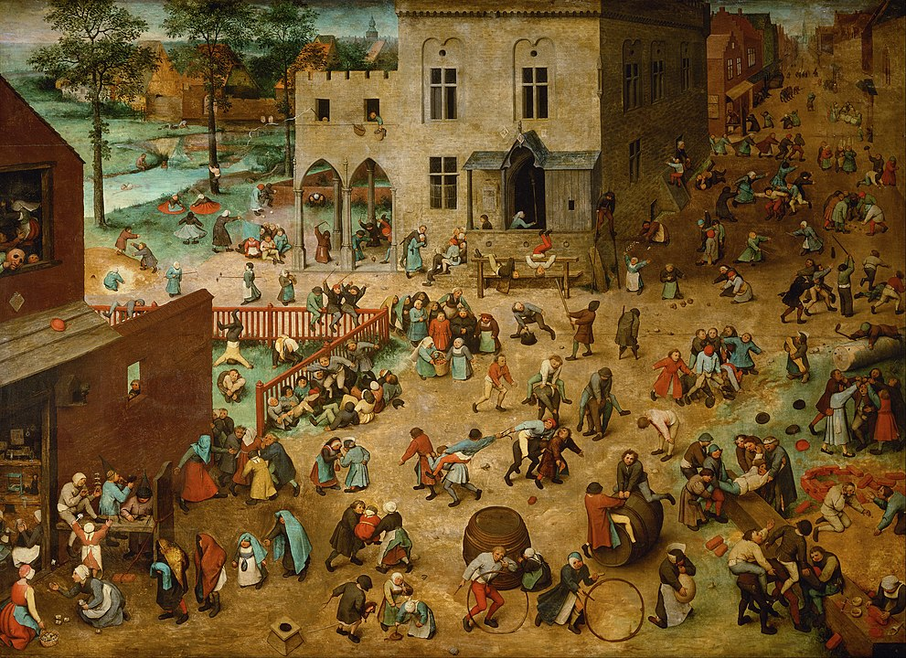

---
Play
2017 Jun
blog
---

# Play

###### Jun 2017

-------------------

##### Pieter Bruegel the Elder's Children's Games 1560  [Wikimedia Commons](https://commons.wikimedia.org/wiki/File:Pieter_Bruegel_the_Elder_-_Children%E2%80%99s_Games_-_Google_Art_Project.jpg)

I have always been frustrated with how Play is naively defined; for instance, a google search yields the following top result:
> **Play:** *Noun.* Activity engaged in for enjoyment and recreation, especially by children*.

Animals of all kinds seem to engage in Play; even Dinosaurs, the deadly, cold-blooded reptiles, had a playful side! It is not merely an activity for enjoyment or recreation. Many of the ideas I discuss here are adopted from the Dutch thinker and historian [Johann Huizinga](https://en.m.wikipedia.org/wiki/Johan_Huizinga) I subscribe to his school of thought as an appreciator of Play, and as a student of its craft.

As the sole extant species of the genus Homo, we're disposed to pompous surmises of human divinity. Without a doubt, Man is the dominant animal on the planet; however, our primacy is newly acquired. For millions of years, Man roamed the earth as a mammal of no significance; only withstanding the tremendous liablities of raising human infants metamorphosed hominins into the modern human being. It is without a doubt how we developed our most potent weapon: Language.
Nevertheless, the sophistication of our societies and civilizations typifies the socialization instinct; the urge to procreate is manifested in social constructs, we further culturized the consumption of nutrient in our rich Cuisines. We do not add features or alter the very essence of our instincts; we merely exhibit behavioural modernity.
---------

## The Instinct of Play

We do not expound Sex as an activity that adults engage in for orgasm; though equally shallow, the facileness of defining Play as a recreational activity enjoyed by children is often neglected. All mammals play; in fact, Play is older than culture for culture presupposes human society. The historian Johan Huizinga has asserted that human civilization added no essential feature to the general idea of Play, animals of all kinds did not wait for man to teach them their playing. Dinosaurs inhabited the planet millions of years prior to hominids; yet still, evidence suggested they played. The instinctual essence of Play, although overlooked, is irrefutable due to its integrality within animal life. Play is not derived from a purely biological or a physical need; it is not a physiological phenomenon or a psychological reflex, even in its purest of forms. Many psychologists and scientists hypothesized biological functions for Play; some of which include:

* Play is
  * \- A result of a need for *relaxation.*
  * \- A discharge of abundant vital energy.
  * \- A method by which young animals learn essential survival skills.
  * \- A *wish-fulfillment* activity.
  * \- An activity that satisfies the natural need for dominance and competition in a non-harmful environment.
  
All of these hypotheses share common flaws, the inadequacy to encompass all instances of Play stands glaring,Huizinga concluded that the assumption that Play must serve a biological function is a fallacious one; ergo theweakness of the hypotheses above. He further insisted that Play cannot be considered without its profoundly aestheticproperties, and must not be thought of as a rational activity. A theory that describes the function of Play mustrender all the previous hypotheses obsolete, or unify them as a coherent whole. It’s challenging to define or explainPlay, but it’s not difficult to differentiate it from what it’s not, Play is not the opposite of seriousness, it isnot for children, Play is not rudimentary, senseless, artificial, pretentious or man-made.

---

## *H. Ludens*

The 18th century and its age of Enlightenment ignited Anti-clericalism and the worship of reason. The substantial advances of the 16th and 17th centuries in science and human thought blinded the many. We boldly, or perhaps naively, decided to name our species *Homo Sapiens*, Man the Rational. Thinkers refuted *Sapiens* as a name for our species, notwithstanding our ability to reason, irrationality is deeply rooted in human behaviour. We inclined to designate our species as *Homo Faber*, Man, the Maker; although, not as misleading as *Sapiens*, it is an unseemly name for a ruthless destroyer. Besides, the use of *H. Faber*:

> is a manifestation of man's innate being in nature, which represents the alienation from and objectification of nature.

as the Italian philosopher Umberto Eco argued. Johan Huizinga suggested *Homo Ludens,* Man, the Player. Linguistically, however, the Latin word *Luden* carries more meaning than merely Play.

---