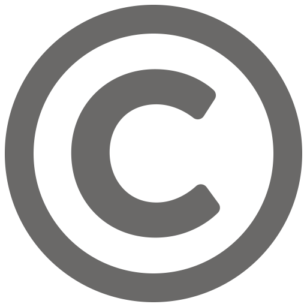

---
Automatery
2019 Jan
blog
---
# Automatery
###### Jan 2019
----

##### Slate Statue of Alan Turing by Stephen Kettle  [DawnNKnox](https://dawnknox.com/)
I believe university trained me in mathematical rigour and analysis, but the actual Computer Science I learned myself. However, having been guided by world-class Computer Scientists and Mathematicians at the University of Waterloo, was, without a doubt, a priceless privilage that only so many are lucky to have, but it is not a requirment, at least not in Computer Science.
Countless high quality resources are available, mostly at no cost, for you to explore or learn this truly enabling craft.
---
## Setup

### Prefer Linux or macOS over Windows

If you're a windows user, dual boot a Linux distrbution next to Windows, I recommend Ubuntu for its easy of use and a smooth install/configuration experience. Here's a tutorial to walk you through the steps: How To install Ubuntu. You can still use Windows if you'd like, I just personally don't recommend it.

### The Command Line

Learn how to work with a command line interface. Here's a tutorial

### Code Editor

Many good options exists, I personally use Neovim, but it's not beginner friendly, and I frankly cant offer an argument on how it could benefit you in the long run. Other beginner friendly options:

* \- Visual Studio Code
* \- Atom
* \- Sublime Text

---

## Compute

### Code 

You probably wondered how Computers turn strings of binary digits (0s and 1s) into meaning, this is explained beautifully in Code. I read this book in highschool, and I keep getting back to it from time to time, it provided me with a solid understanding of how a computer works. By the end of the first 9 chapters, you should understand how we abstract and manipulate natural numbers to imitate our brains, how only two symbols are needed to convey everything there is to convey. You should also answer the question, Why only two symbols? why not one symbol, or Three?

### Expressing Computation & designing Programs

Learn how to communicate intent to a computer, and I am intentionally not using "learn a programming language" here for a reason.
The goal is not to learn a language, but how programs are designed and implemented. There are many styles and many languages to choose from, and for learning purposes, I recommend Racket to learn functional programming, then C to learn imperative programming.

Dont attempt to learn both at the same time, I highly recommend beginning with a Dr.Racket while using How To Design Programs as a reference and a curriculum.

The C Programming Language is an excellent reference to use while learning C.

---

## Math

Computer Science is a subfield of Mathematics, and Mathematical maturity is assumed in theoritcal computer science, Mathematics for Computer Science is an MiT ccourse that covers a wide range of topics such as Proof Construction, Set Theory, Graph Theory, Counting.

### Measuring Change

Single-Variable Differential and Integral Calculus.

### Abstraction

Pay careful attention to Linear Algebra if you're aiming to make video games. A reference that have been constantly recommended on the topic is Linear Algebra Done Right
